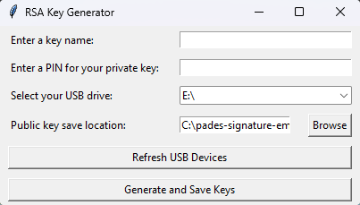

# RSA Key Generator

This project provides a simple application for generating RSA key pairs, encrypting the private key, and saving the keys to specified locations. The application is built using Python and utilizes the Tkinter library for the graphical user interface.



## Installation

To run this project, you need to have Python installed on your system. It is recommended to create a virtual environment to manage dependencies. You can install the required dependencies using pip. 

1. Clone the repository or download the project files.
2. Navigate to the RSA directory.
3. Create a virtual environment:

```
python -m venv .venv
```

4. Activate the virtual environment:

- On Windows:

```
.venv\Scripts\activate
```

- On macOS and Linux:

```
source .venv/bin/activate
```

5. Install the required packages:

```
pip install -r requirements.txt
```

## Usage

Run the application by executing the `gui.py` file.

```
python src/gui.py
```